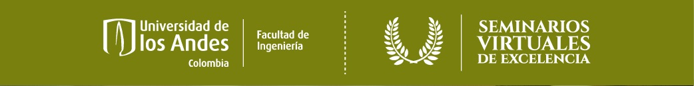

## Acerca de Certificados de Seminarios Virtuales de Excelencia

Es una aplicación desarrollada usando el framework Laravel 6, la cual se enfoca en administrar los certificados de Los Seminarios Virtuales de Excelencia.
