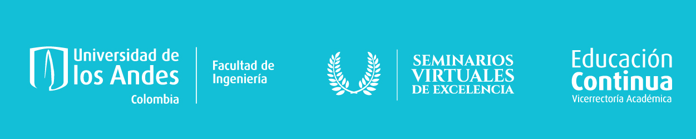

## Acerca de Certificados de Seminarios Virtuales de Excelencia

Es una aplicación desarrollada en Laravel que se enfoca en adminsitrar eventos de Los Seminarios Virtuales de Excelencia para entregar los certificados a sus asistentes.
Esta desarrollada usando el framework Laravel 6 de PHP
